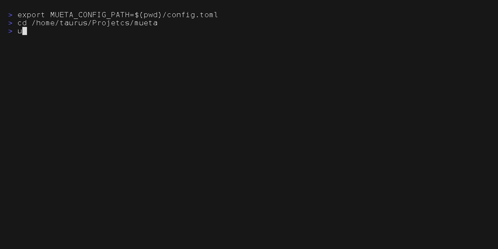
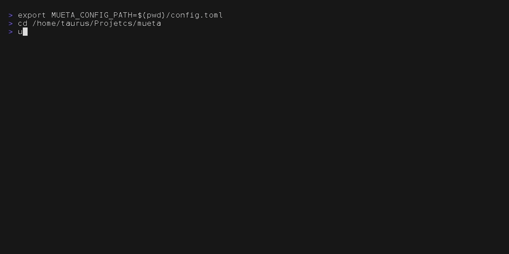

# Mueta

## 介绍
这是一个可以为音频自动获取各种元属性（如艺术家、专辑、歌词、流派等等）的 CLI 程序。

> [!IMPORTANT]
> **关于数据来源**
>
> Mueta 使用以下数据源：
> - **官方 API**: AcoustID, MusicBrainz, Genius (需要 API Key)
> - **非官方 API**: NetEase Cloud Music (网易云音乐), QQ Music
>
> ⚠️ **非官方 API 风险提示**：NetEase 和 QQ Music 的 API 为非官方逆向接口，可能存在以下风险：
> - API 格式随时可能变更导致功能失效
> - 可能存在访问频率限制
> - 不保证长期稳定性
>
> 建议优先使用官方 API 来源的数据。非官方来源仅作为补充。

## 安装

### 依赖
- Python >= 3.12
- [fpcalc](https://acoustid.org/chromaprint) (Chromaprint 命令行工具)

### 使用 uv 安装（推荐）
```bash
# 克隆项目
git clone https://github.com/oodenX/mueta.git
cd mueta

# 安装为全局 CLI 工具
uv tool install -e .

# 验证安装
mueta --version
```

### 使用 pip 安装
```bash
# 克隆项目
git clone https://github.com/oodenX/mueta.git
cd mueta

# 安装
pip install -e .

# 验证安装
mueta --version
```

### 安装 fpcalc（必须）
```bash
# Ubuntu/Debian
sudo apt install libchromaprint-tools

# macOS
brew install chromaprint

# Arch Linux
sudo pacman -S chromaprint
```

### 打包为独立可执行文件 (Standalone Binary)
如果你不想在目标机器上安装 Python 环境，可以使用 PyInstaller 将其打包为独立的可执行文件。

1. **安装打包依赖**:
```bash
pip install pyinstaller
```

2. **执行打包**:
```bash
# 在项目根目录下运行
pyinstaller --onefile --name mueta --paths src src/mueta/main.py
```

3. **使用**:
打包完成后，在 `dist/` 目录下会生成 `mueta` (Windows 为 `mueta.exe`)。你可以将其移动到 `/usr/local/bin` 或其他系统的 PATH 目录中直接使用。

## 使用
### 初始化程序
用来初始化，并且配置基本的信息（API_KEY），音乐和歌词默认存储位置等等。
```bash
mueta init
```
然后会引导用户输入 **AcoustID API key** 等等信息。

### 音频分析 (BPM/Key)


v0.2.0 新增功能。使用 Essentia 算法分析音频的 BPM (速度)、Key (调性) 和响度等特征，并写入文件标签。

```bash
mueta analyze [OPTIONS] PATH
```

**参数**:
- `PATH`: 文件或文件夹路径。

**选项**:
- `-r --recursive`: 递归处理子文件夹。
- `-f --force`: 强制重新分析（即使已有 BPM/Key 标签）。

### 获取一个音频的所有元属性


用来获取这个音频的所有的元属性。
```bash
mueta view-meta FILE
```
**参数**：
- `FILE`: 文件名称，以 mp3、flac、acc等音频格式。

**选项**:
- `-c --cover`: 是否显示封面，但是终端的分辨率非常低，不建议加上。

### 获取文件的所有的元属性



获取单个或者多个文件的元属性，文件用空格分开，可以选择是否有歌词，并且选择是否嵌入歌词到元属性中，或者一个 lrc 文件。
```bash
mueta get-meta [OPTIONS] FILES
```
**参数**:
- `FILES`: 文件名称，多个，以 mp3、flac、acc 等音频格式。

**选项**:
- `-l --lyric`: 是否下载 .lrc 歌词，歌词保存到默认的位置。
- `-e --embedded`: 是否嵌入歌词，歌词会嵌入到歌词的元属性中，但是有的播放器可能不会使用。
- `-c --cover`: 是否下载封面嵌入音频，默认打开。
- `-w --workers`: 并行数，默认为3，可以根据自己的需求调整，要求为整数。
- `-i --interactive`: 交互式模式，当有多个匹配结果时手动选择（此模式下 workers 强制为 1）。
- `-a --analyze`: 同时进行音频分析 (BPM/Key)。



### 获取文件夹下所有文件的所有的元属性
获取一个文件夹下面所有的音频的元属性，可以选择是否有歌词，并且选择是否嵌入歌词到元属性中，或者一个 lrc 文件。
```bash
mueta get-meta-from-folder [OPTIONS] FOLDER
```
**参数**:
- `FOLDER`: 文件夹路径。

**选项**:
- `-l --lyric`: 是否下载 .lrc 歌词，歌词保存到默认的位置。
- `-e --embedded`: 是否嵌入歌词，歌词会嵌入到歌词的元属性中，但是有的播放器可能不会使用。
- `-c --cover`: 是否下载封面嵌入音频，默认打开。
- `-r --reserve`: 保留原文件（复制而不是移动）。
- `-w --workers`: 并行数，默认为3，可以根据自己的需求调整，要求为整数。
- `-i --interactive`: 交互式模式，当有多个匹配结果时手动选择（此模式下 workers 强制为 1）。
- `-a --analyze`: 同时进行音频分析 (BPM/Key)。

## 支持的格式
- MP3
- FLAC
- M4A/AAC
- OGG Vorbis
- Opus
- WAV
- WMA

## 贡献者
- **开发者**: oodenX
- **e-mail**: ven3428set@163.com
