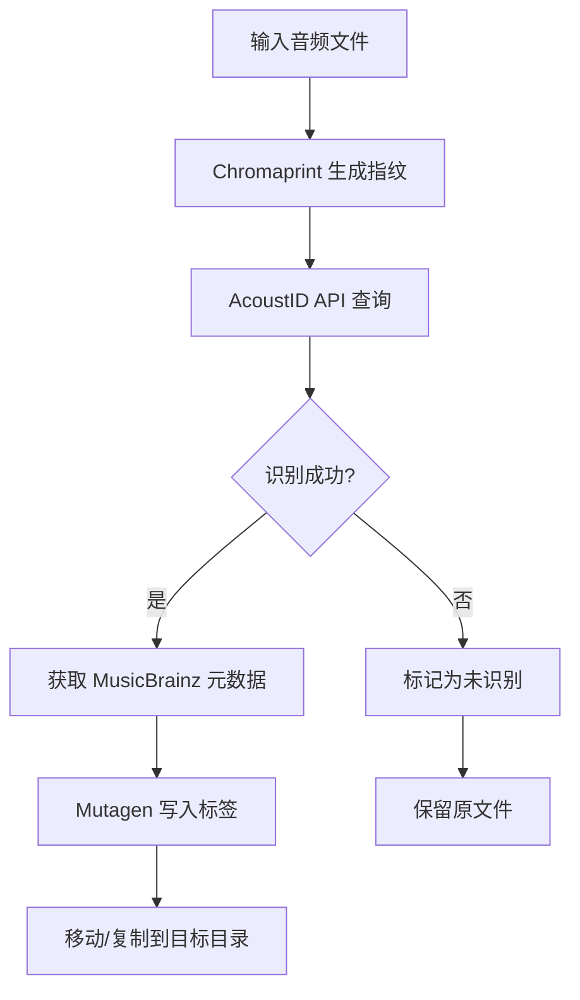
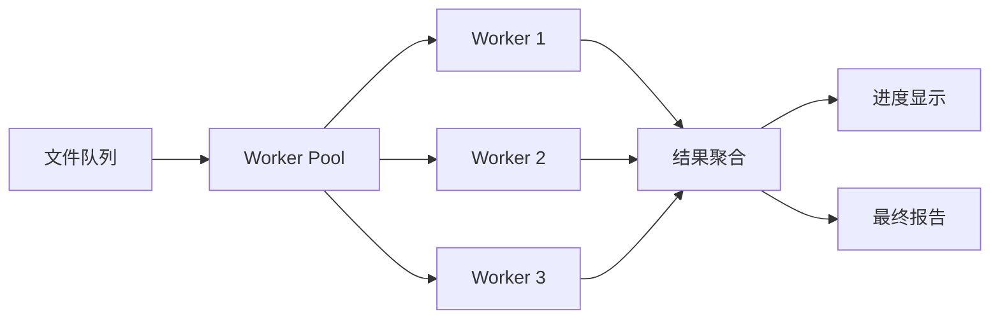

# Mueta 架构文档

## 项目概述

**Mueta** (Music Meta Auto getter) 是一个自动获取音频元数据的 CLI 工具，通过音频指纹识别技术自动匹配曲目信息。

## 技术栈

| 组件 | 技术 | 用途 |
|------|------|------|
| CLI 框架 | Typer + Rich | 命令行界面和美化输出 |
| 音频指纹 | Chromaprint + AcoustID | 音频识别 |
| 元数据处理 | Mutagen | 读写音频标签 |
| HTTP 客户端 | HTTPX | 异步网络请求 |
| 日志 | Loguru | 结构化日志 |
| 配置 | Pydantic Settings | 类型安全配置 |

## 目录结构

```
mueta/
├── src/
│   └── mueta/
│       ├── __init__.py
│       ├── main.py           # 程序入口点
│       ├── cli/              # CLI 命令定义
│       │   └── commands.py   # Typer 命令实现
│       ├── core/             # 核心配置
│       │   ├── config.py     # Pydantic Settings 配置
│       │   └── logging.py    # 日志设置
│       ├── engine/           # 业务逻辑引擎
│       │   ├── fingerprint.py    # 音频指纹生成
│       │   ├── acoustid.py       # AcoustID API 客户端
│       │   ├── metadata.py       # 元数据处理
│       │   └── processor.py      # 批处理调度器
│       └── utils/            # 工具函数
│           └── helpers.py
├── config.toml               # 用户配置文件
├── pyproject.toml            # 项目配置
└── docs/                     # 文档目录
```

## 核心工作流程



## 并行处理架构



## 配置系统

### config.toml
```toml
[default]
audio_save_dir = "/home/user/.mueta/audio"
lyrics_save_dir = "/home/user/.mueta/lyrics"

[acoustid]
acoustid_api_key = "your-api-key"
```

## 支持的音频格式

| 格式 | 扩展名 | 读取 | 写入 |
|------|--------|------|------|
| MP3 | .mp3 | ✅ | ✅ |
| FLAC | .flac | ✅ | ✅ |
| AAC/M4A | .m4a, .aac | ✅ | ✅ |
| OGG Vorbis | .ogg | ✅ | ✅ |
| Opus | .opus | ✅ | ✅ |
| WAV | .wav | ✅ | ⚠️ 有限 |
| WMA | .wma | ✅ | ✅ |

## API 依赖

### AcoustID
- **端点**: `https://api.acoustid.org/v2/lookup`
- **认证**: API Key (免费申请)
- **限制**: 每秒 3 次请求

### MusicBrainz
- **端点**: 通过 AcoustID 间接访问
- **数据**: 艺术家、专辑、曲目信息

## 错误处理

| 错误类型 | 处理方式 |
|----------|----------|
| 网络超时 | 自动重试 3 次 |
| API 限流 | 退避重试 |
| 未识别曲目 | 记录日志，跳过处理 |
| 文件格式错误 | 提前验证并过滤 |
